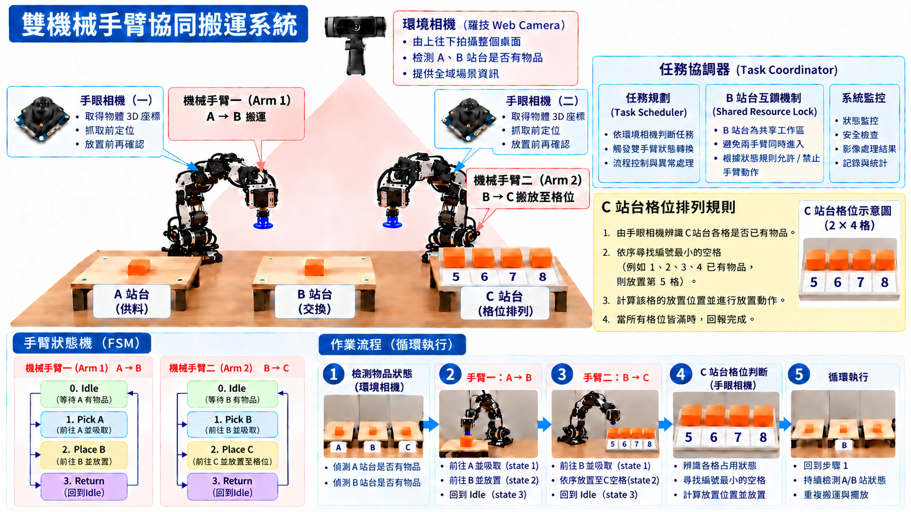
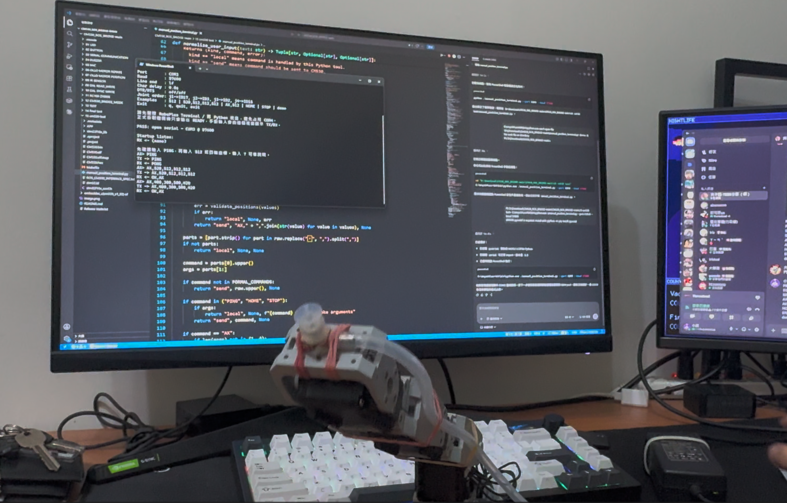
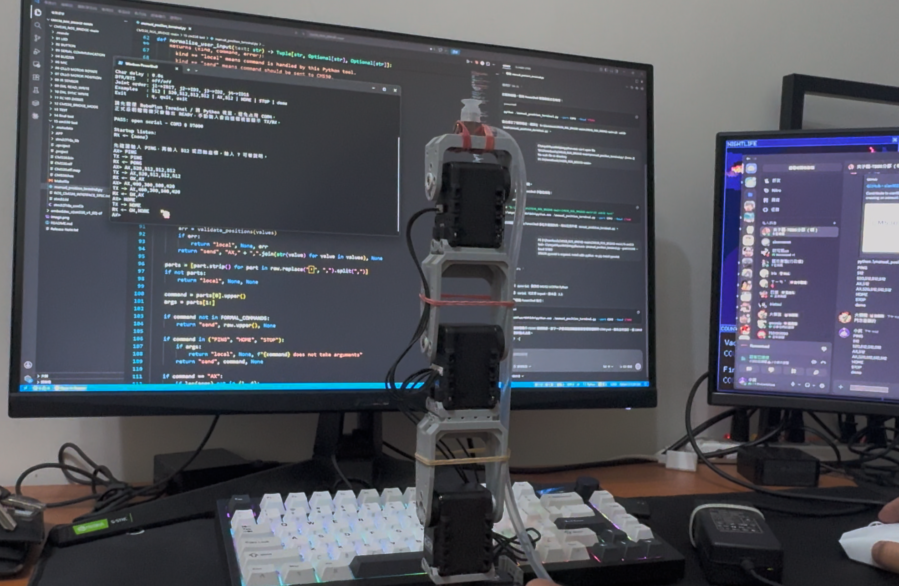
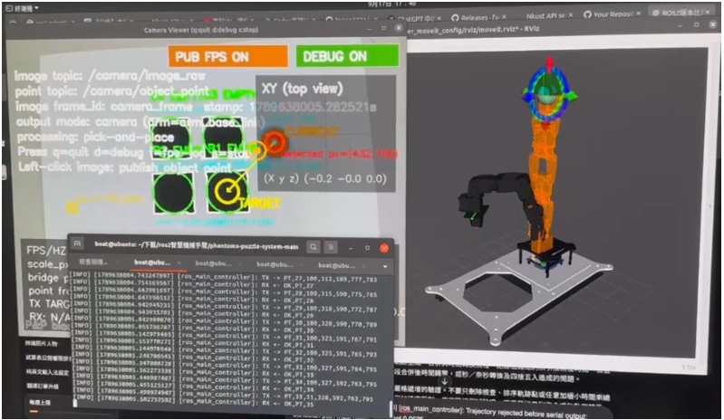

# Intelligent-Robot-Arm｜視覺導引雙臂協同搬運系統

以 **Orin、ROS 2、三路視覺與雙機械手臂**建構小型物件搬運原型，讓手臂 1 完成 **A → B** 供料交接，手臂 2 完成 **B → C** 搬運與 **2 × 4 八格排列**。系統依據現場影像決定取放時機，透過 B 站互鎖管理共用工作區，並在 C 站選擇編號最小的空格放置物件。

本專案為海事資訊科技系「海事學院第八屆學生專題製作競賽暨成果展」海事實作組作品。本儲存庫提供系統設計、作業流程、整合進度及驗證規劃；CM-530 韌體與測試工具另維護於 [CM530_ROS_BRIDGE](https://github.com/xian1022/CM530_ROS_BRIDGE)。

> **目前階段：子系統已具前期測試成果，雙臂全流程仍在整合。** 構想書記錄的單臂實測、第 17 版韌體的離線驗證，以及預期的雙臂自動搬運成果，在下文分別標示；本儲存庫目前不含可直接啟動完整系統的 ROS 套件。



*架構圖取自作品構想書。圖中 C 站上列 1～4 已占用、下列 5～8 為空格，下一件應放第 5 格。圖示為系統設計示意。*

## 目錄

- [專案目標與設計範圍](#project-scope)
- [系統架構與模組分工](#architecture)
- [視覺辨識與座標換算](#vision)
- [完整搬運流程](#workflow)
- [雙臂狀態機與 B 站互鎖](#coordination)
- [C 站八格排列規則](#placement)
- [控制介面與動作確認](#control)
- [目前成果與開發進度](#progress)
- [取得文件與韌體測試入口](#getting-started)
- [整合與效能驗證計畫](#validation)
- [儲存庫結構與文件來源](#repository)
- [參考文獻](#references)

<a id="project-scope"></a>

## 專案目標與設計範圍

固定順序的取放控制，無法自行處理交接站尚有物件、目標格位已占用或相機辨識失效等情況。本作品將視覺取放延伸為三站分工，結合全域觀測、局部定位及任務狀態，探索小型產線中的協同搬運與自動整列。

| 工作區 | 功能 | 主要作業手臂 | 判斷依據 |
|---|---|---|---|
| A 站 | 供料與取料 | 手臂 1 | 環境相機判斷有料，手眼相機 1 定位 |
| B 站 | 共用交接區，採固定取放座標 | 手臂 1 放料、手臂 2 取料 | 物件占用、使用權及離區確認 |
| C 站 | 2 × 4 格位排列，每格一件 | 手臂 2 | 手眼相機 2 判斷占用與放置結果 |

初期作業對象為**等高方塊、已知站台高度、單層排列**。B 站交接採先放下、再由另一臂取走；兩臂可在各自獨立工作區作業，但不可同時進入 B 站。完整系統目標包含八格填滿回報、異常暫停、人工清臺及確認後續行。

<a id="architecture"></a>

## 系統架構與模組分工

系統以「環境觀測 → 局部定位 → 任務協調與運動規劃 → 馬達與吸盤致動 → 回饋確認」形成作業循環。

| 模組 | 硬體／技術 | 責任 |
|---|---|---|
| 主控平台 | Orin、ROS 2 | 整合視覺、任務排程、狀態機、通訊與紀錄 |
| 環境觀測 | 上方 USB 相機 1 顆 | 監看 A、B 站物件與全域場景 |
| 局部定位 | 手眼 USB 相機 2 顆 | 取放前定位、局部確認；相機 2 另負責 C 站格位辨識 |
| 影像處理 | OpenCV | 色彩分割、輪廓分析、面積篩選與占用判斷 |
| 運動規劃 | MoveIt 2、phantomx_pincher 模型 | 規劃關節路徑、檢查模型碰撞與可達性 |
| 任務協調器 | ROS 2 任務邏輯 | 雙臂 FSM、B 站互鎖、C 站選格、異常與滿格處理 |
| 馬達控制 | CM-530、兩組 AX-12A 手臂 | 接收主機命令，執行關節目標與位置回讀 |
| 吸盤控制 | ESP32、真空吸盤模組 | 規劃以 micro-ROS 接收吸附／釋放命令，待整合 |
| 操作與監控 | 視覺畫面、手臂模型、通訊紀錄 | 顯示辨識結果、規劃資訊、命令回覆及異常事件 |

三顆相機的觀測結果由 ROS 2 整合；CM-530 負責馬達介面，B 站互鎖及 C 站選格由主控端管理。MoveIt 2 的模型碰撞檢查需配合實際模型、校正及現場驗證，不能僅憑規劃成功判定實體交接已完成。

### 硬體配置

- Orin 主控平台。
- 兩組 AX-12A 機械手臂；目前韌體每臂控制四個關節。
- 一塊 CM-530，兩臂共用主機序列埠與 DYNAMIXEL bus。
- 三顆 USB 攝影機：一顆環境相機、兩顆手眼相機。
- ESP32 吸盤控制模組與雙吸盤機構，控制整合待驗證。
- A／B 站台、C 站八格排列臺與等高測試方塊。

實際主控環境的 ROS 2、JetPack、作業系統與 Docker 映像版本，須在整合部署時固定並記錄；構想書引用 Jazzy 文件，不代表整套 Orin 部署已完成 Jazzy 相容性驗證。

<a id="vision"></a>

## 視覺辨識與座標換算

環境相機先提供 A、B 站有料／無料資訊，手眼相機再進行取放位置確認。影像處理規劃利用 OpenCV 色彩分割、輪廓與面積篩選找出目標，並依校正關係轉換為機械手臂可用的位置。

```text
相機影像
  → 色彩分割、輪廓分析、面積篩選
  → 物件影像位置／站台與格位占用
  → 影像與手眼校正
  → 結合站台高度、方塊厚度及吸盤偏移
  → 手臂座標系中的取放目標
  → IK 可達性與運動規劃
  → 執行、位置回讀及取放後視覺確認
```

**三顆 USB 相機不直接量測深度。** 架構圖中的「3D 座標」是以校正後影像位置配合已知幾何條件換算，初期不涵蓋任意高度堆疊或未知形狀物體的深度估測。

C 站依格板幾何建立固定「格號 ↔ 位置」對應，依各區域影像判斷占用，不需要辨讀被物件遮住的格號。影像尺度、手眼轉換、IK 可達範圍及吸盤偏移仍須實機校正；辨識不明時暫停重拍，不把未知狀態當成空格。

<a id="workflow"></a>

## 完整搬運流程

以下流程圖為雙臂作業與異常分支的主要依據，可點選檢視完整解析度。

[](docs/images/dual-arm-flowchart.png)

### 1. 初始化與狀態確認

1. 初始化三路相機視覺節點、手臂、吸盤及任務協調器。
2. 主控端確認通訊、校正值與可行路徑，要求雙臂返回 Home_A／Home_C，並確認姿態。
3. 環境相機辨識 A、B 站狀態；手眼相機 2 判斷 C 站八格占用。
4. 依物件狀態與使用權啟動兩臂狀態機。

這是系統啟動流程；CM-530 第 17 版開機本身不會自動回 HOME 或啟用 torque。

### 2. 手臂 1：A → B

1. 在 Home_A 等待，確認 A 站有料且允許供料。
2. 由手眼相機 1 定位，確認目標有效且可達。
3. 規劃並執行取料路徑，回讀確認到位後啟動吸盤。
4. 保持吸附返回 Home_A，等待 B 站為空且協調器核准使用權。
5. 進入 B 站固定放置位置，確認到位後釋放物件。
6. 返回 Home_A；確認手臂已退出 B 站且放置成功，才更新 B 站有料並釋放使用權。

### 3. 手臂 2：B → C

1. 在 Home_C 觀測 C 站，確認仍有可用空格。
2. 確認 B 站有料並取得使用權，規劃前往 B 站的取料路徑。
3. 執行取料、回讀確認到位、吸附物件，保持吸附返回 Home_C。
4. 確認到達 Home_C 且已退出 B 站，才釋放使用權並更新 B 站物件狀態。
5. 放置前確認 C 站占用，選擇最小編號空格及其對應座標。
6. 規劃並執行放置路徑，確認到位後釋放物件；確認就位並更新占用，返回 Home_C。

### 4. 滿格與重新開始

確認 C 站八格皆占用後，回報本批完成並停止雙臂**新增搬運**；B 站若有餘料，保留原位。操作人員清空 C 站並確認續行後，重新確認雙臂姿態、持物狀態及各站占用，再開始下一批。不得僅將軟體格位計數歸零就接續舊任務。

<a id="coordination"></a>

## 雙臂狀態機與 B 站互鎖

| 狀態 | 手臂 1 | 手臂 2 |
|---|---|---|
| `state0` 等待 Idle | Home_A 待機，等待 A 站有料且允許供料 | Home_C 待機，確認 C 有空格並等待 B 站有料 |
| `state1` 取料 Pick | 從 A 站取料，返回 Home_A 持物等待 | 取得 B 站使用權後取料，退回 Home_C 並確認離區 |
| `state2` 放置 Place | B 站為空且取得使用權後放料 | 選擇 C 站最小空格並放置 |
| `state3` 返回 Return | 返回 Home_A，確認放置與離區後釋放 B 站 | 返回 Home_C，接續下一輪觀測 |

### 互鎖規則

**B 站「物件占用」與「手臂使用權」分開管理。** B 站沒有物件，不代表另一臂已離開；有物件也不代表可立即進入。

- 使用權由單一任務協調器核發，同一時間最多允許一臂使用。
- 手臂 1 進入前需確認 B 站為空；手臂 2 需確認 B 站有料且 C 站有空格。
- 使用權涵蓋進入、取放及退出，必須確認離區後才釋放。
- 手臂 2 取料退出 B 站後即可釋放使用權，不必等到 C 站放置完成。
- 尚待動作或影像確認時持續等待並維持鎖定；確認失敗或逾時則暫停並回報。
- 影像失效、掉料、通訊中斷或共用區狀態不明時，禁止自動放行；復歸後重新確認姿態、持物與各站狀態。

<a id="placement"></a>

## C 站八格排列規則

格位依固定觀測方向編號，上列由左至右為 1～4，下列為 5～8：

```text
┌─────┬─────┬─────┬─────┐
│  1  │  2  │  3  │  4  │
├─────┼─────┼─────┼─────┤
│  5  │  6  │  7  │  8  │
└─────┴─────┴─────┴─────┘
```

每格只放一件。手臂 2 在 B 站取料前先確認 C 站有空格，放置前再確認目標格位；選擇所有已確認空格中的最小編號，放置後確認物件就位才更新占用。

| 已確認占用 | 下一個目標 | 原因 |
|---|---|---|
| 全空 | 1 | 最小編號空格 |
| 1、2、3、4 | 5 | 上列已滿，接續下列 |
| 1、3、5 | 2 | 非連續缺格優先補最小編號 |
| 1～8 | 無 | 回報滿格並停止新增搬運 |
| 存在無法確認的格位 | 暫停重拍確認 | 未知不等於空格，不能可靠判定最小空格 |

<a id="control"></a>

## 控制介面與動作確認

以下摘要對應 **CM-530 第 17 版／主機文字協定 5**。完整命令、錯誤格式與重連規則見 [ROS–CM530 對接規格][interface]。

| 通訊區段 | 設定 |
|---|---|
| 主控端 ↔ CM-530 | USART3、57600 baud、8N1、無流量控制 |
| CM-530 ↔ AX-12A | USART1、1 Mbps、DYNAMIXEL Protocol 1.0 |
| ROS 2 ↔ ESP32 吸盤 | 規劃採 micro-ROS，介面與整合尚待驗證 |

| 手臂 | j1 馬達 ID | j2 | j3 | j4 | HOME 設定 |
|---|---:|---:|---:|---:|---|
| `arm1` | 17 | 3 | 2 | 15 | `home_A`，目前四軸皆為 512 |
| `arm2` | 12 | 1 | 8 | 16 | `home_C`，目前四軸皆為 512 |

位置欄位為 AX-12A 原始整數 `0..1023`，並非 rad、degree 或 XYZ。ROS 端必須依零點、方向及機構限位換算。**HOME 的 512 初值待實機校正；HOME 是程式預設姿態，不是原點感測器校正程序。**

| 命令範例 | 用途／成功回覆 |
|---|---|
| `VERSION` | 核對版本，回覆 `VERSION,5` |
| `PING` | 通訊確認，回覆 `PONG` |
| `GET_HOME,arm1` | 查詢預設姿態，回覆 `HOME,arm1,512,512,512,512` |
| `AX,arm1,512,512,512,512` | 設定四軸目標，回覆 `OK,AX,arm1` |
| `HOME,arm1` | 寫入 HOME 目標，回覆 `OK,HOME,arm1` |
| `READ,arm1` | 回讀四軸，回覆 `POS,arm1,j1,j2,j3,j4` |
| `HOLD,arm1` | 四軸全讀成功後寫為保持目標，回覆 `OK,HOLD,arm1` |
| `TORQUE,arm1,1`／`TORQUE,arm1,0` | 啟用／關閉施力，回覆相應 `OK,TORQUE,arm1,1`／`0` |
| `LED,arm1,MOVING`／`LED,arm1,STOPPED` | 狀態燈顯示，回覆相應 LED ACK |

所有 `arm1` 命令可改為 `arm2`。兩臂共用連線，任何時刻最多一筆待回覆命令；逐筆核對命令及手臂，再發下一筆。建議命令以 LF 結尾，韌體回覆為 CRLF。

### ACK 與任務完成的差別

`OK,AX`／`OK,HOME` 僅表示本地處理或傳送成功，**不代表機械已到位，也不代表吸取或放置成功**。ROS 應以新的 READ 樣本檢查四軸目標誤差、連續穩定次數與到位期限，再配合影像判斷取放結果及 B 站離區。

- 開機不自動移動；啟用 torque 前，該臂須先有成功的 AX／HOME／HOLD 目標。
- AX／HOME／HOLD 本身不啟用 torque；已有 torque 時寫入新目標可能立即動作。
- READ 任一軸失敗不回部分位置；HOLD 必須四軸全讀成功才寫入保持目標。
- HOLD 有讀取與通訊延遲，不是硬體急停；`TORQUE,0` 是卸力，`LED,STOPPED` 只是燈號。
- 逾時、錯配或斷線後停止新軌跡，命令結果視為未知，不自動重送；韌體沒有斷線自動 HOLD／卸力機制。
- 只有連線同步且前一筆命令已結束時，才能按明確策略發 HOLD；共用區未確認前維持鎖定。

構想書實測照片中的 `OK_AX`／`OK_HOME` 為前期介面紀錄，不能直接套用至協定 5；新整合請以上述逗號格式與對接規格為準。

<a id="progress"></a>

## 目前成果與開發進度

截至 2026-10-07，依作品構想書及韌體驗證紀錄整理如下。

| 項目 | 狀態與證據範圍 |
|---|---|
| 電腦指令 → CM-530 → AX-12A | 構想書記錄前期單臂 AX 移動與 HOME 返回實體測試 |
| ROS 2／Docker、手臂模型與 MoveIt 2 | 已建立前期環境與整合介面；畫面仍有軌跡遭拒紀錄 |
| 視覺 Service 座標請求 | 程式建置與基本測試已有紀錄；自動實體取放穩定性待驗證 |
| 第 17 版雙臂韌體與測試終端 | 已提供 AX、HOME、GET_HOME、READ、HOLD、TORQUE、LED |
| 第 17 版離線驗證 | [驗證紀錄][firmware-validation]記載 Python 25/25、C 邏輯／LED 測試及 ARM 映像檢查通過 |
| 第 17 版燒錄及 HOME／READ／HOLD 實機測試 | 待驗收，不以離線結果取代實機證據 |
| 三相機校正、雙臂交接與 B 站互鎖 | 待整合驗證 |
| ESP32／micro-ROS 雙吸盤介面 | 待整合驗證 |
| C 站八格決策、滿格續行及全流程效能 | 已定義設計與驗證方式，尚無完整實測數據 |

### 前期實體手臂測試

| AX 指令移動 | HOME 返回預設姿態 |
|---|---|
|  |  |

*照片取自構想書，說明前期基本位置控制已串接，不代表新版雙臂全流程已完成。*

### 視覺與規劃整合介面



左上為視覺辨識與定位資訊，右側為手臂模型與規劃資訊，左下為通訊紀錄。畫面包含軌跡遭拒紀錄，反映當時仍在進行介面整合與除錯。

<a id="getting-started"></a>

## 取得文件與韌體測試入口

### 取得本專案文件

```bash
git clone https://github.com/xian1022/Intelligent-Robot-Arm.git
cd Intelligent-Robot-Arm
```

本儲存庫目前以 README 與圖像為主；ROS 節點、launch 檔、校正參數與 ESP32 程式尚未收錄，因此目前沒有全系統一鍵啟動指令。

### 取得 CM-530 韌體與終端

另開終端，取得韌體儲存庫並進入第 17 版資料夾：

```powershell
git clone https://github.com/xian1022/CM530_ROS_BRIDGE.git
cd "CM530_ROS_BRIDGE/17 ROS to CM530 ver. dual arm"
python -m pip install -r requirements.txt
python manual_position_terminal.py --self-test
```

實機已完成馬達 ID、供電、通訊及韌體配置後，將 `COM4` 改為實際序列埠：

```powershell
python manual_position_terminal.py --port COM4 --arm arm1
```

ROS 與手動終端不可同時占用序列埠。先執行 VERSION／PING、GET_HOME 與 READ 核對，再依實際校正及路徑條件進行動作。範例位置值不是已驗證的機構安全姿態。

| 開發工作 | 文件入口 |
|---|---|
| 韌體操作、建置與燒錄 | [第 17 版 README][firmware-readme] |
| ROS 序列通訊、錯誤及重連 | [ROS–CM530 對接規格][interface] |
| HOME 姿態設定 | [arm_config.h][arm-config] |
| 已執行檢查與實機驗收清單 | [VALIDATION.md][firmware-validation] |

<a id="validation"></a>

## 整合與效能驗證計畫

### 整合順序

1. **單臂校正：**確認關節方向、零點、限位、HOME、吸盤偏移及位置回讀。
2. **三相機辨識：**完成 A／B 有料判斷、手眼座標換算、C 站八格占用與未知狀態處理。
3. **單臂取放與吸盤：**驗證規劃、到位、吸附、放置及結果確認。
4. **雙臂狀態機：**串接 A→B 與 B→C，明確記錄每個狀態的進入與完成條件。
5. **B 站互鎖：**驗證同時申請、進出區確認、延遲及異常時不重複授權。
6. **C 站排列與續行：**驗證最小空格、非連續缺格、全滿、保留 B 站餘料及人工清臺續行。
7. **全流程測試：**固定軟硬體版本與校正參數，記錄成功率、時間及異常原因。

### 測試規模與評估指標

以下是構想書中的**預計測試，尚非實測數據**：至少 10 批由空臺至八格填滿，共 80 次搬運；另對「前四格已占用」「非連續空格」「全滿」三種初始狀態各重複 3 次。改變 A 站方塊位置與照明，記錄失敗及人工介入原因。

| 評估面向 | 預計紀錄與檢查 |
|---|---|
| 辨識與定位 | A／B 有料與 C 格位占用判斷正確率、定位誤差、吸取成功率 |
| 交接與排列 | 完整 A→B→C 搬運成功率、最小空格選擇正確率、八格完成率、掉料／跨格／重複放置／錯序 |
| 互鎖與復歸 | 同時申請、未離區、遮擋、通訊中斷、異常暫停與滿格停止供料 |
| 時間與效率 | 單件搬運時間、B 站等待時間、每批八件時間；比較依序與獨立區域並行作業，另記清臺時間 |

紀錄應包含各站占用、手臂狀態、放置格號、命令與回覆、作業時間及異常事件。預期交付包含雙臂搬運原型、八格排列臺、三路視覺節點、任務協調器、吸盤介面、校正紀錄與示範影片；完成後再補入對應程式、資料及實測結果。

<a id="repository"></a>

## 儲存庫結構與文件來源

```text
Intelligent-Robot-Arm/
├── README.md
└── docs/
    └── images/
        ├── dual-arm-system-overview.png   # 構想書系統架構圖
        ├── dual-arm-flowchart.png         # 雙臂完整流程圖
        ├── arm-ax-test.png                # 前期 AX 實測照片
        ├── arm-home-test.png              # 前期 HOME 實測照片
        └── vision-planning-interface.png  # 前期整合介面
```

本 README 依下列資料整理：

1. 《海事資訊科技系－作品構想書－視覺導引雙臂協同搬運系統－參考文獻修訂版 (2)》：專案動機、設計、前期成果、圖像及效能驗證規劃。
2. `流程圖.png`：雙臂並行分支、Home_A／Home_C、B 站互鎖、異常等待與滿格續行。
3. [CM530_ROS_BRIDGE 第 17 版文件][firmware-readme]：新版控制介面及驗證進度；本次核對版本為 [`e333c16`](https://github.com/xian1022/CM530_ROS_BRIDGE/commit/e333c162d2b21efc05fad47182741caa23ab6a59)。

架構圖與前期成果照片由指定構想書擷取，流程圖保留原始圖檔。下列參考文獻沿用構想書；其中原記載的檢索日期為 2026-10-01。

<a id="references"></a>

## 參考文獻

1. ROS 2 Documentation. [Topics vs Services vs Actions](https://docs.ros.org/en/jazzy/How-To-Guides/Topics-Services-Actions.html). Jazzy.
2. ROBOTIS. [CM-530](https://emanual.robotis.com/docs/en/parts/controller/cm-530/). ROBOTIS e-Manual.
3. ROBOTIS. [AX-12A](https://emanual.robotis.com/docs/en/dxl/ax/ax-12a/). ROBOTIS e-Manual.
4. C. Smith et al. [Dual arm manipulation—A survey](https://doi.org/10.1016/j.robot.2012.07.005). *Robotics and Autonomous Systems*, 60(10), 1340–1353, 2012.
5. F. Chaumette and S. Hutchinson. [Visual servo control. I. Basic approaches](https://doi.org/10.1109/MRA.2006.250573). *IEEE Robotics & Automation Magazine*, 13(4), 82–90, 2006.
6. I. Enebuse et al. [Accuracy evaluation of hand-eye calibration techniques for vision-guided robots](https://doi.org/10.1371/journal.pone.0273261). *PLOS ONE*, 17(10), e0273261, 2022.
7. MoveIt Documentation. [Planning Scene](https://moveit.picknik.ai/main/doc/examples/planning_scene/planning_scene_tutorial.html).
8. OpenCV. [Thresholding Operations using inRange](https://docs.opencv.org/4.x/da/d97/tutorial_threshold_inRange.html).
9. OpenCV. [Structural Analysis and Shape Descriptors](https://docs.opencv.org/4.x/d3/dc0/group__imgproc__shape.html).
10. snt-spacer. [phantomx_pincher](https://github.com/snt-spacer/phantomx_pincher). GitHub 原始碼儲存庫。
11. OpenCV. [Camera Calibration and 3D Reconstruction](https://docs.opencv.org/4.x/d9/d0c/group__calib3d.html).

[firmware-readme]: https://github.com/xian1022/CM530_ROS_BRIDGE/blob/main/17%20ROS%20to%20CM530%20ver.%20dual%20arm/README.md
[interface]: https://github.com/xian1022/CM530_ROS_BRIDGE/blob/main/17%20ROS%20to%20CM530%20ver.%20dual%20arm/ROS_CM530_INTERFACE_SPEC.md
[firmware-validation]: https://github.com/xian1022/CM530_ROS_BRIDGE/blob/main/17%20ROS%20to%20CM530%20ver.%20dual%20arm/VALIDATION.md
[arm-config]: https://github.com/xian1022/CM530_ROS_BRIDGE/blob/main/17%20ROS%20to%20CM530%20ver.%20dual%20arm/APP/inc/arm_config.h
